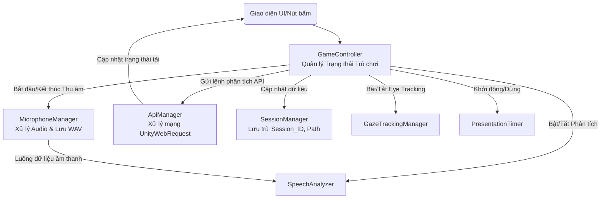

# Kế hoạch Refactor Chi tiết Hệ thống VR Presentation Trainer

Cấu trúc hiện tại đang gặp tình trạng "God Object", nơi mà file `PauseMenuManager.cs` ôm đồm gần như toàn bộ logic: từ UI, thu âm Micro, cắt ghép file WAV, quản lý trạng thái, cho đến việc gọi API (UnityWebRequest). Việc này khiến code rất dài (hơn 700 dòng), khó debug, và dễ lỗi trên môi trường VR.

Kế hoạch này sẽ chẻ nhỏ hệ thống thành các module chuyên biệt (Single Responsibility). 

## Kiến Trúc Hệ Thống Đề Xuất (Architecture)



---

## User Review Required

> [!WARNING]
> Bản refactor này sẽ tạo ra **3 file C# mới** và cắt bỏ khoảng **400 dòng code** từ `PauseMenuManager`.
> Trong Unity Inspector, bạn sẽ cần tạo một GameObject trống tên là `[Managers]` để gắn các Script mới này vào. Bạn có đồng ý với cấu trúc chi tiết dưới đây không?

---

## Proposed Changes (Chi tiết từng File)

### 1. Lớp Trạng thái & Điều phối (State Machine & Game Controller)
#### [NEW] `Assets/Scripts/Managers/GameController.cs`
Đây là bộ não điều phối các hành động, được thiết kế bám sát **Sơ đồ Flowchart** mà bạn vừa cung cấp.
- **Trạng thái (Enum):**
  ```csharp
  public enum GameState { 
      Presentation,      // Đang thuyết trình
      Break,             // Nghỉ giữa Q&A (tắt mic, chờ)
      QuestionReading,   // NPC đứng lên hỏi, hiển thị câu hỏi
      QuestionAnswering, // Người dùng trả lời câu hỏi
      Finished           // Kết thúc toàn bộ, gửi API
  }
  ```
- **Các hàm chuyển đổi trạng thái (State Transitions):**
  - `StartPresentation()`: Chuyển sang **Presentation State**. Mở Mic, bắt đầu ghi âm (`presentation.wav`), bật Eye Tracking, bật Tracking âm lượng. Cập nhật UI.
  - `FinishPresentation()`: Người dùng bấm 'Finish presentation'. Chuyển sang **Break State**. Tắt ghi âm presentation, tắt tracking, Mute Mic.
  - `StartNextQuestion()`: Từ Break State chuyển sang **Question Reading State**. Chọn NPC đứng lên hỏi, hiển thị bảng câu hỏi, bắt đầu đếm ngược thời gian đọc.
  - `StartAnswering()`: Chuyển sang **Question Answering State**. Mở lại Mic, bắt đầu ghi âm câu trả lời. Cập nhật UI hiện nút 'Finish answer' và 'Finish Q&A'.
  - `FinishAnswer()`: Người dùng bấm 'Finish answer'. Kết thúc ghi âm câu trả lời, Mute Mic. Kiểm tra xem còn bộ câu hỏi không? Nếu còn -> Quay lại **Break State**. Nếu hết -> Chuyển sang **Finished**.
  - `FinishQnA()`: Người dùng bấm 'Finish Q&A' (Dừng sớm). Kết thúc toàn bộ phiên thuyết trình. Chuyển sang **Finished**.
  - `ProcessFinalSubmission()`: Ở trạng thái **Finished**. Bắt đầu gửi Transcript tất cả file ghi âm lên API, sau đó chuyển sang màn hình Dashboard.
- **Hệ thống chấm điểm thời gian (Time Evaluation):**
  - Trong quá trình ở trạng thái `Presentation` và `QuestionAnswering`, `GameController` sẽ duy trì đếm giờ (hoặc điều phối `PresentationTimer`) để tính toán thời gian nói, thời gian dừng. Dữ liệu thời gian này sẽ được tổng hợp lại để gửi trong cục `EvaluateRequest` ở bước cuối cùng.

### 2. Lớp Âm thanh (Audio & Hardware)
#### [NEW] `Assets/Scripts/Managers/MicrophoneManager.cs`
Trút bỏ gánh nặng xử lý mảng float (`float[] chunkData`) khỏi `PauseMenuManager`.
- **Chức năng chính:**
  - `StartRecording(string fileName)` và `StopRecording()`.
  - Quản lý trạng thái Mic (Mute / Unmute) theo đúng sơ đồ của bạn.
- **Lợi ích:** Tránh rò rỉ bộ nhớ (RAM) do lưu mảng float trực tiếp trong UI Manager, tự động ghi file ra ổ cứng.

### 3. Lớp Mạng (Network & API)
#### [NEW] `Assets/Scripts/Managers/ApiManager.cs`
Đưa toàn bộ `UnityWebRequest` và `HttpWebRequest` vào đây.
- **Chức năng chính:**
  - `Task<AnalyzeResponse> UploadContextAsync(string pdfPath, string txtPath)`
  - `IEnumerator SubmitBatchAudioCoroutine(string sessionId, List<string> audioFiles, Action<bool> onComplete)`
  - `IEnumerator EvaluateCoroutine(string sessionId, EvaluateRequest data, Action<string> onPdfReceived)`

### 4. Lớp Giao diện (UI)
#### [MODIFY] `Assets/Scripts/PauseMenuManager.cs` & `QuestionDialogManager.cs`
- **Xóa bỏ:** Các code xử lý ghi âm, đếm thời gian phân tích, gọi API lằng nhằng.
- **Chỉ giữ lại:** 
  - Giao diện UI thay đổi tùy theo biến `GameState` do `GameController` quản lý. (Ví dụ: Đang ở `Presentation` thì hiện bảng Presentation Session, ở `Break` thì hiện bảng Q&A Session).
  - Khi người dùng bấm nút trên bảng điều khiển, UI Manager chỉ việc gọi hàm của `GameController` (vd: `GameController.Instance.FinishAnswer()`).

#### [MODIFY] `Assets/Scripts/GameModeManager.cs`
- **Xóa bỏ:** Toàn bộ logic `HttpWebRequest`, thay vào đó gọi `ApiManager.Instance.UploadContextAsync()`.
- **Chỉ giữ lại:** Code quản lý các nút chọn File (PDF, TXT) ở màn hình sảnh (Lobby).

---

## Luồng Hoạt Động Cụ Thể (Data Flow Scenario)

Để bạn dễ hình dung, đây là những gì xảy ra khi bạn bấm nút **"Nộp bài" (End Q&A)**:

1. Người dùng dùng tia Laser bấm nút "Nộp Bài" trên `PauseMenuManager`.
2. `PauseMenuManager` gọi `GameController.Instance.SubmitAllData()`.
3. `GameController` ra lệnh:
   - "Ê `MicrophoneManager`, dừng thu âm và lưu file câu hỏi cuối cùng lại!"
   - "Ê `GazeTracker` & `SpeechAnalyzer`, dừng đo đạc và chốt điểm số (AC4)!"
   - "Ê `UI`, hiện màn hình Loading 'Đang xử lý...' lên cho user xem đi!"
4. Sau khi mọi thứ lưu xong, `GameController` gom dữ liệu đưa cho `ApiManager`:
   - "Ê `ApiManager`, mang đống file Wav và JSON này gửi lên API `/evaluate` đi."
5. `ApiManager` gửi xong, nhận file PDF về, báo lại cho `GameController`:
   - "Tải xong rồi nha sếp, PDF nằm ở đường dẫn này."
6. `GameController` bảo UI load cái PDF đó lên bảng. Xong quy trình!

---

## Verification Plan

Sau khi tui viết xong code, chúng ta sẽ kiểm tra bằng cách:
1. Xác minh trong Editor: Code không báo lỗi cú pháp đỏ nào.
2. Kiểm tra Hierarchy: Bạn sẽ tạo thêm 1 cục `Managers` và gán các file script tương ứng.
3. Chạy thử quy trình Upload PDF -> Vào phòng -> Nộp bài: Xác minh đường dẫn gọi hàm đã trơn tru theo luồng mới.
